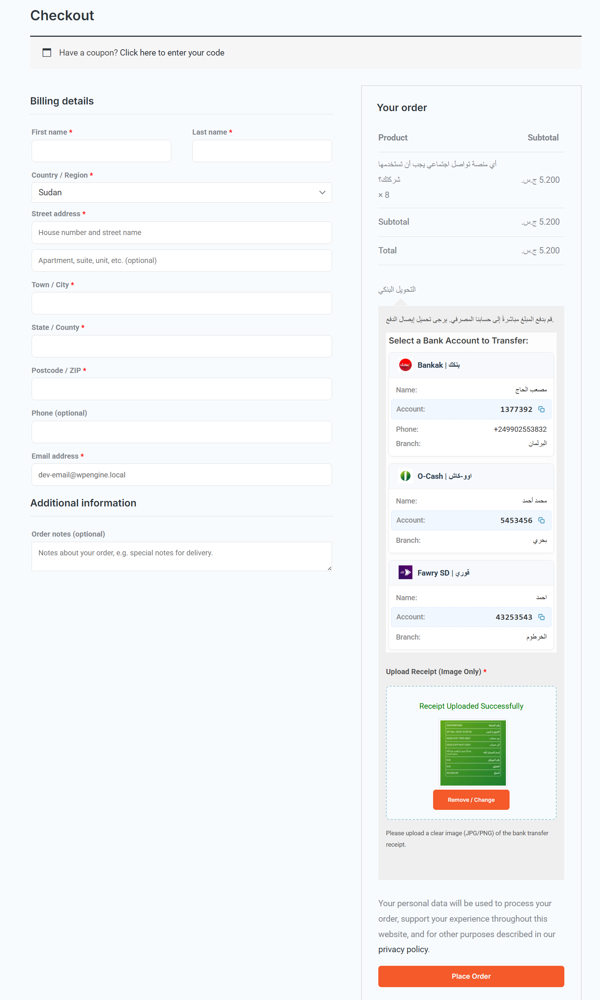
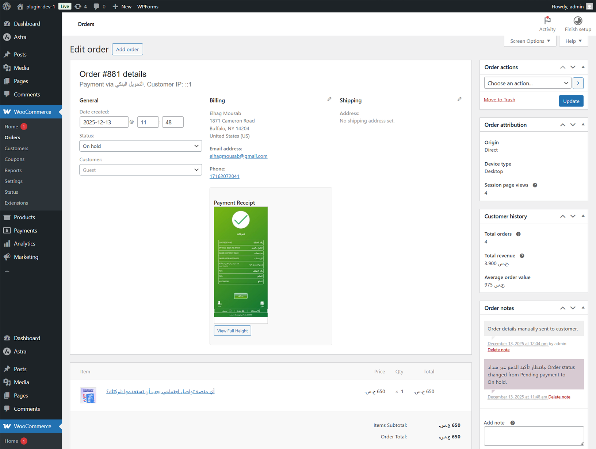

# Sudan Online Payments for WooCommerce

**Accept payments via Sudanese Bank Transfers effortlessly.**

🚩 **Important Notice:** This is an unofficial, independently developed plugin. It is not affiliated with, endorsed by, or connected to any specific Sudanese bank, payment service (like Bankak or O-Cash), or financial company.

Sudan Online Payments for WooCommerce is an unofficial gateway that facilitates manual bank transfers for the Sudanese market.

Sudan Online Payments for WooCommerce is a robust WooCommerce payment gateway designed specifically for the Sudanese market. It allows store owners to display their local bank account details (Bankak, O-Cash, Fawry, etc.) and requires customers to upload a payment receipt image during checkout. 

This plugin streamlines the manual bank transfer process by validating receipt uploads, providing a user-friendly interface, and organizing order data for store admins.

## 🚀 Features

-   **Sudanese Bank Support**: Pre-configured icons and labels for major services:
    -   🏦 Bankak (Bank of Khartoum)
    -   🏦 O-Cash
    -   🏦 Fawry (Faisal Islamic Bank)
    -   🏦 SyberPay
    -   🏦 MyCashi
    -   🏦 Bravo
    -   🏦 Custom/Other Banks
-   **Receipt Upload System**: 
    -   **AJAX-powered**: Instant upload without page reload.
    -   **Validation**: Strictly accepts images only (JPG, PNG) with size limits.
    -   **Preview**: Customers see a thumbnail of their uploaded receipt.
    -   **Required Step**: Prevents order placement without a receipt.
-   **Interactive Checkout UI**:
    -   Modern **Card Grid** layout for bank accounts.
    -   **One-Click Copy** for account numbers.
    -   Responsive design for mobile and desktop.
-   **Admin Management**:
    -   **Dynamic Settings**: Add, remove, and reorder bank accounts easily.
    -   **Visual Setup**: Select banks and see their icons instantly in the backend.
    -   **Order Integration**: View uploaded receipts directly in the Order Edit screen (with zoom).
-   **Localization**: Fully translated into **Arabic** and English.

## 🛠 Installation

1.  Download the plugin zip file.
2.  Go to your WordPress Admin > **Plugins** > **Add New**.
3.  Click **Upload Plugin** and select the zip file.
4.  Activate the plugin.

## ⚙️ Configuration

1.  Go to **WooCommerce** > **Settings** > **Payments**.
2.  Enable **Sudan Online Payments** (or "Bank Transfer (Sudan)").
3.  Click **Manage** (or "Set up") to configure:
    -   **Title/Description**: Customize what customers see.
    -   **Bank Accounts**: Add your bank details. Select the Bank Name (e.g., Bankak) to automatically display the correct branding icon.
4.  Save changes.

### ⚠️ Important: Checkout Page Setup
This plugin relies on standard WooCommerce hooks which may not render correctly with the newest "WooCommerce Checkout Block". For the best experience and to ensure the payment form shows up:
1.  Edit your **Checkout** page.
2.  Remove the "Checkout Block" if present.
3.  Add a **Shortcode** block.
4.  Paste: `[woocommerce_checkout]`
5.  Update the page.

## 📸 Screenshots

### Checkout Page

### Admin Settings

### Order Recieved

## 📦 Requirements

-   WordPress 5.0+
-   WooCommerce 3.0+
-   PHP 7.4+

## 📄 Changelog

### 1.0.0
-   Initial Release.
-   Added support for major Sudanese payment apps.
-   Implemented secure AJAX receipt upload.
-   Added Arabic translations.

## ☕ Support My Work

If you find this plugin helpful, consider supporting its development:
- **Donate**: [mousab.com/support-me](https://mousab.com/support-me/)

## 👤 Author

**Mousab Elhag**
-   Website: [mousab.com](https://mousab.com)

## 📄 License

GPLv2 or later.
